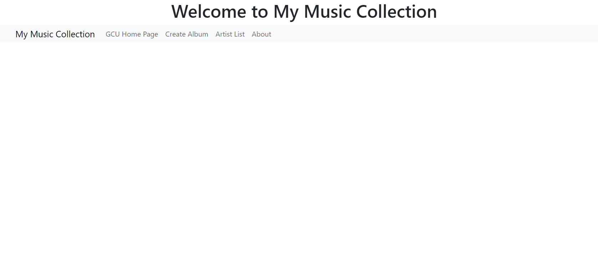
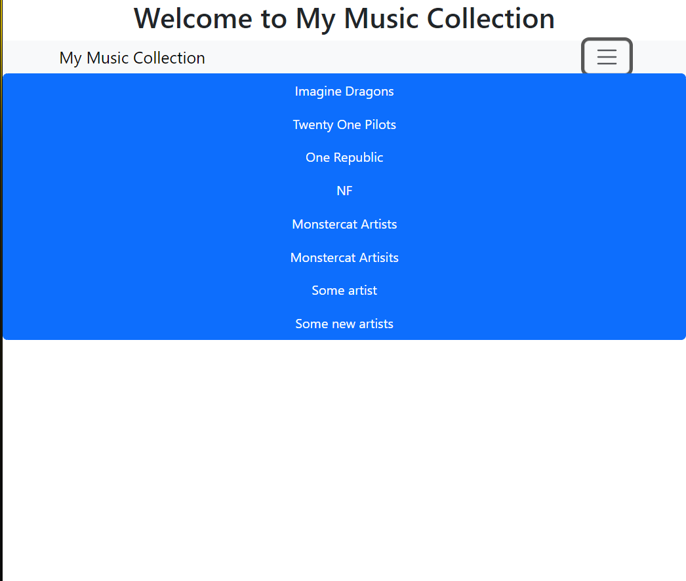
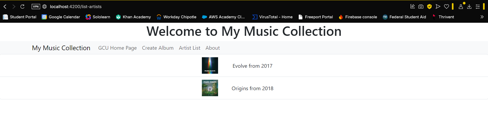
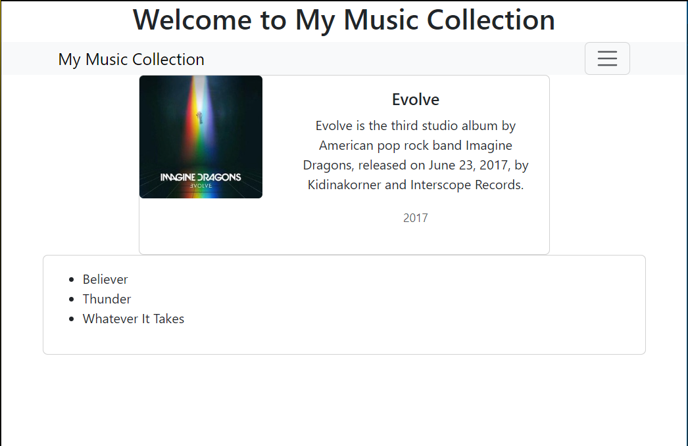
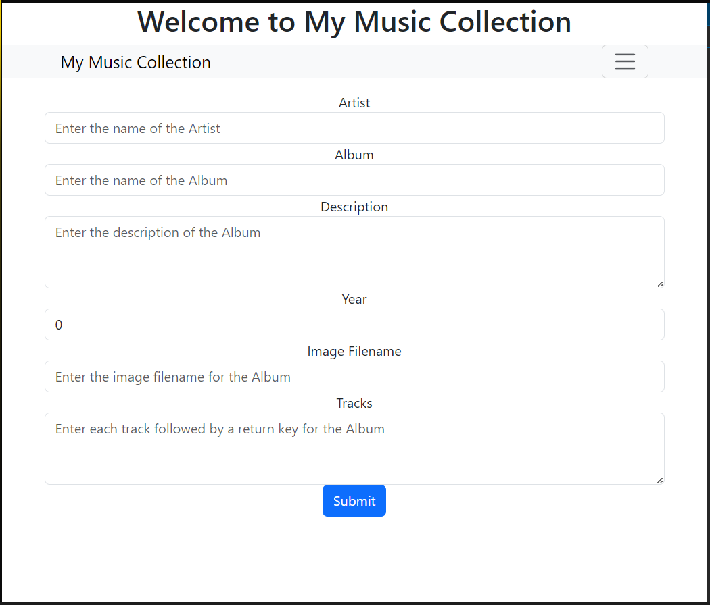

# Activity 4

## Executive Summary
This activity utilizes the application from Activity 3 and the REST API created in Activity 1. The json data was removed and replaced to use the data incoming from the api endpoints.

## Screenshots

Screenshot of the main application screen.

Screenshot of the artist list screen.

Screenshot of the album list screen.

Screenshot of the album display with tracks screen.

Screenshot of the add album screen.

## Research Questions
1. Research how an Angular application maintains a logged in state. How does it communicate this state to the server?

The logged-in state in an Angular app is maintained using JWT authentication which is stateless or session based authentication which is stateful. The authentication token is stored in `localStorage`, `sessionStorage` or it is stored in cookies and is sent in HTTP headers for the authentication. There is an Auth service which manages the login state using `BehaviorSubject` which allows for components to subscribe to authentication changes. For JWT authentication, the user will log in, then the server generates a JWT, and finally Angular stores the JWT. Angular will attach the HWT to HTTP headers. For session based authentication, the server will maintain a session for the user after login and the session Id is stored in cookies. You can protect routes by using `AuthGaurd` which will check authentication before navigation. Angular tracks authentication using tokens, services, and guards while securely communicating with the server using HTTP headers or cookies.

## Conclusion

In this activity, the Music Application was integrated with the music REST API, replacing the static JSON data. The implementation of authentication services would give the application better security and would align it with current web development practices.