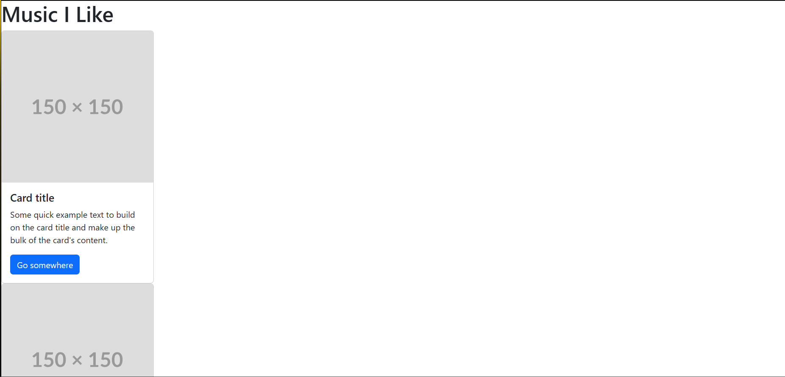
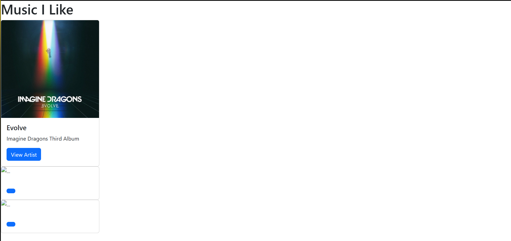
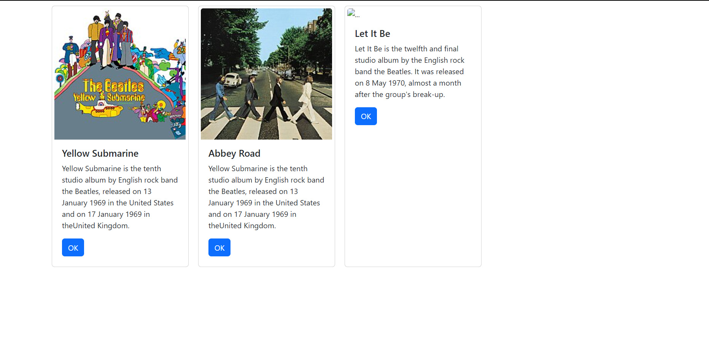
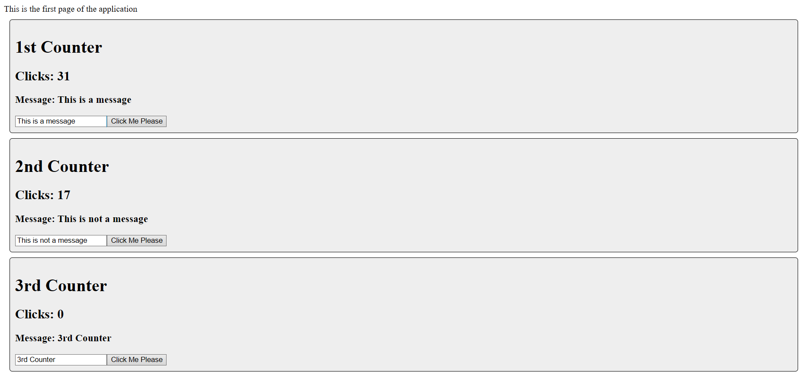

# Activity 5

## Executive summary
This Activity has us build to different applications. The first application is a rendition of our previous music applications but translated into React code. It has basic functionality showcasing the basics of programming in React. It is able to dynamically place data into a row of cards for the user to see. The other application is a counter application with three cards with live counters which changes the state of the UI in real time for the user.  

## Music application

This is a screenshot of the application using the default cards.

Screenshot of the application using the Card component and its parameters filled in.

<!-- Write a one paragraph summary of new lesson features that have been added -->
In this part of the lesson we learned the basics of how a React application is structure. We learned how to use JSX and how to render it's content. We learned how to use arrow functions and build custom components.

---

This is a screenshot of the music application using map to map the data to the cards.

<!-- Write a one paragraph summary of new lesson features that have been added -->
In this part of the lesson we learned how to use the map function to map objects. The map function was used to map the album data to each of the cards to display on the page. We also learned what the difference between state and props in react. The State is a JavaScript object that holds values used inside the application. Props are variables passed to a component by its parent component. Props are static and State is dynamic.

## State Changer Application

This is a screenshot of the counters from the state changer application.

## Conclusion
In this activity I learned how to build a basic React application. I learned how to manipulate the state of components and how to dynamically map data into a component. I learned how to use JSX to build our web pages and how to use Props to build custom reusable components. I also learned how to change the state of the component via user input and interaction. 

