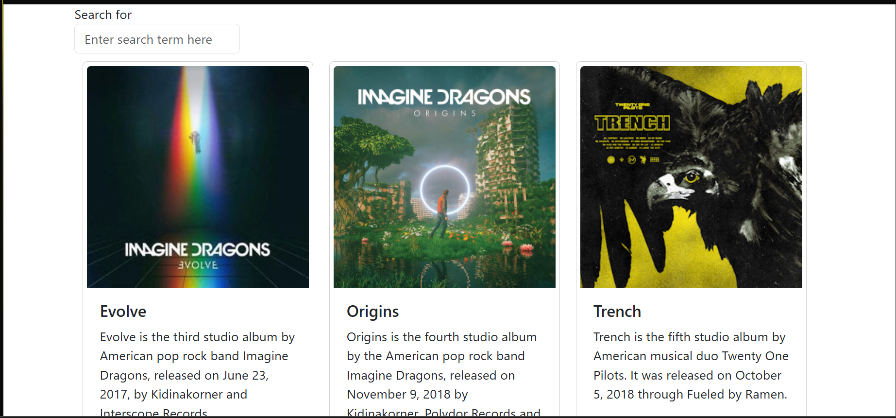
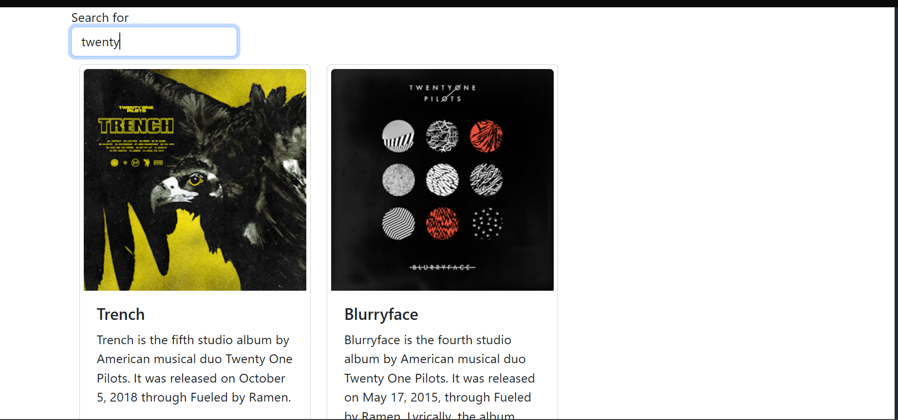
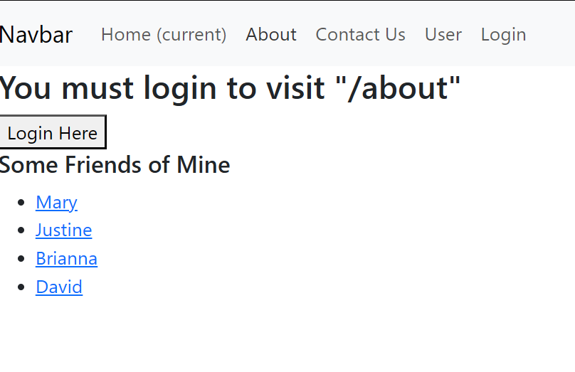
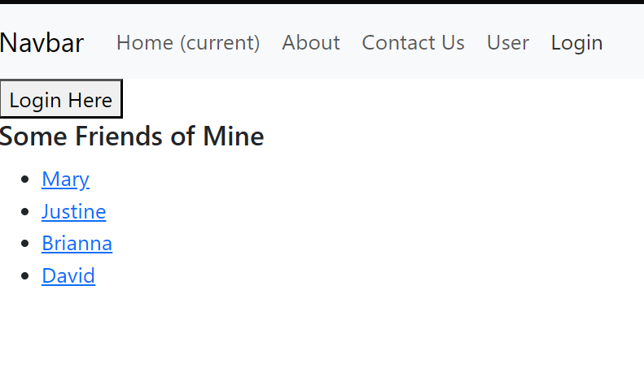
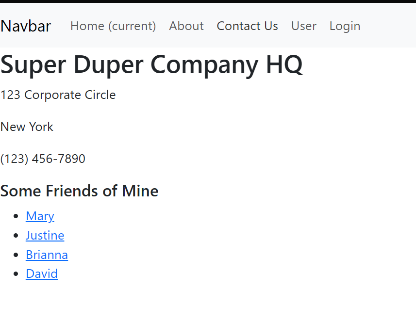
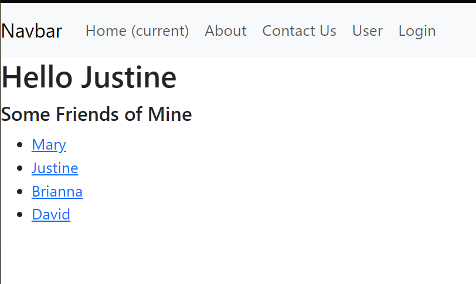
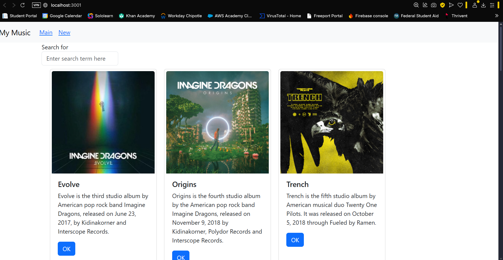
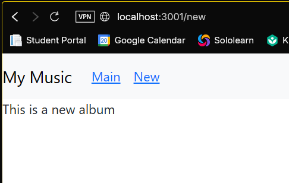
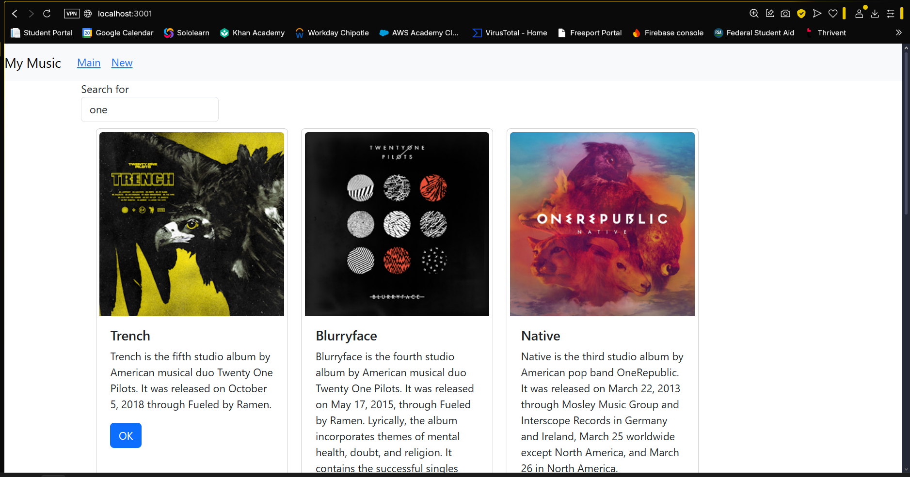

# Activity 6

## Executive Summary

In this lesson we worked on the Music application and built it even further. This application is a React based project that allows users to search for music albums and display the results in Card components. App.js is the file that is managing the state and is refactored into modular components. The app is not connected to the MusicAPI that was created in Activity 1. It is now modified to use a route based navigation. 

## Part 1

This is a screenshot of the application connected to the MusicAPI we created in activity 1.

This shows the search box working and showing only the albums we searched for.

In this lesson, we leaned about React hooks useState and useEffect. These are key to managing component state and side effects like data fetching. useState returns a state variable and a setter. useEffect handles logic that runs after render, like API calls. We also learned about callback functions which allow child components to notify parents of events. Props pass data from parent to child, and callbacks send data upwards. Axios was introduced for REST API calls with async and await which are used to handle asynchronous operations more cleanly than traditional promises.

## Part 2

This is a screenshot of the about page saying that you must login to visit.

This is the login page of the router application.

This is the contact us page after logging in.

This is one of the user pages.

In this lesson we covered routing in React using React Router. A route maps a URL to a component. The `BrowserRouter` is the top level component for managing route based navigation. `useNavigate` and `useLocation` are hooks that give access to navigation and router state, but these only work inside routed components. `PrivateRoute` protects routes and id does this by redirecting unauthorized users to `/login` while preserving the originally requested path via `location.state`. In `PrivateRoute` there is `props.children` which is commonly used to represent nested components.

## Part 3

This is a screenshot of the main application page with the navigation bar.

This is the stud newAlbum page that will be edited in Activity 7.

This is a screenshot of the search bar working in filtering the Albums.

In this part of the lesson was focused on component based design in React. The `renderedList` in App.js was refactored into a separate component. The new container component, `AlbumList` is what now manages the rendering of the list of `Card` components. Another component introduced was `SearchAlbum` and was used to encapsulate both `SearchForm` and `AlbumList`, improving modularity. App.js remains the stateful parent it now also delegates display logic and structure to these children. This now aligns with React best practices of breaking UI into reusable components.

## Conclusion

The key concepts that were taught in this less include state management using useState, side effects via useEffect, and passing data between components using props and callbacks. We learned how to restructure applications to use reusable components and manage user interactions. Another major part of this lesson was refactoring to use Route based navigation. We were able to protect routes using PrivateRoute to prevent unauthorized users from accessing certain pages. We also learned how to fetch data using async/await functions. 