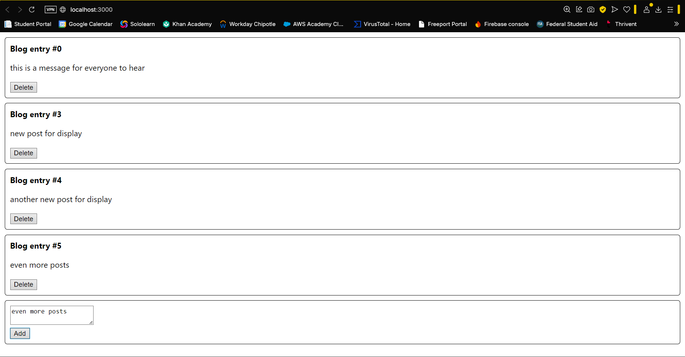
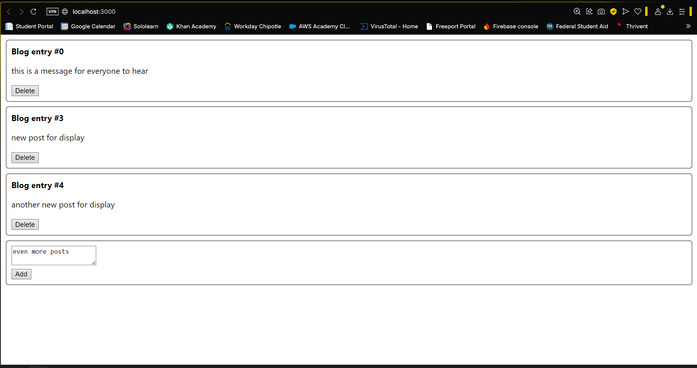
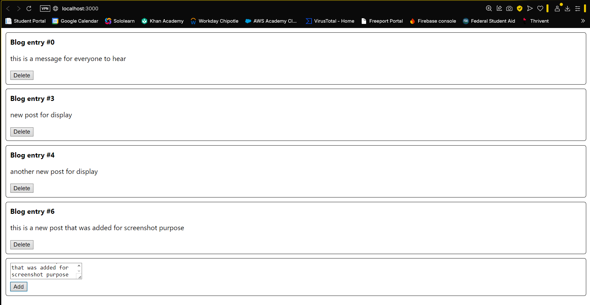
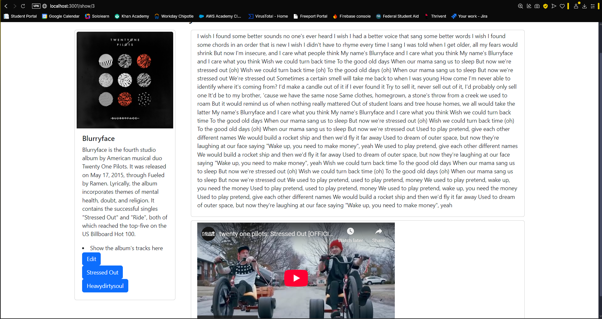
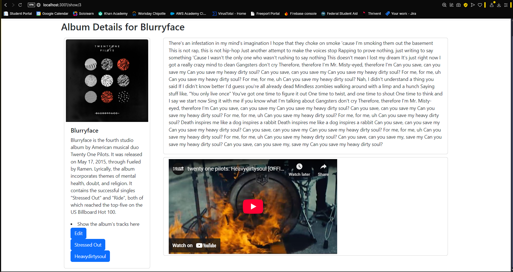
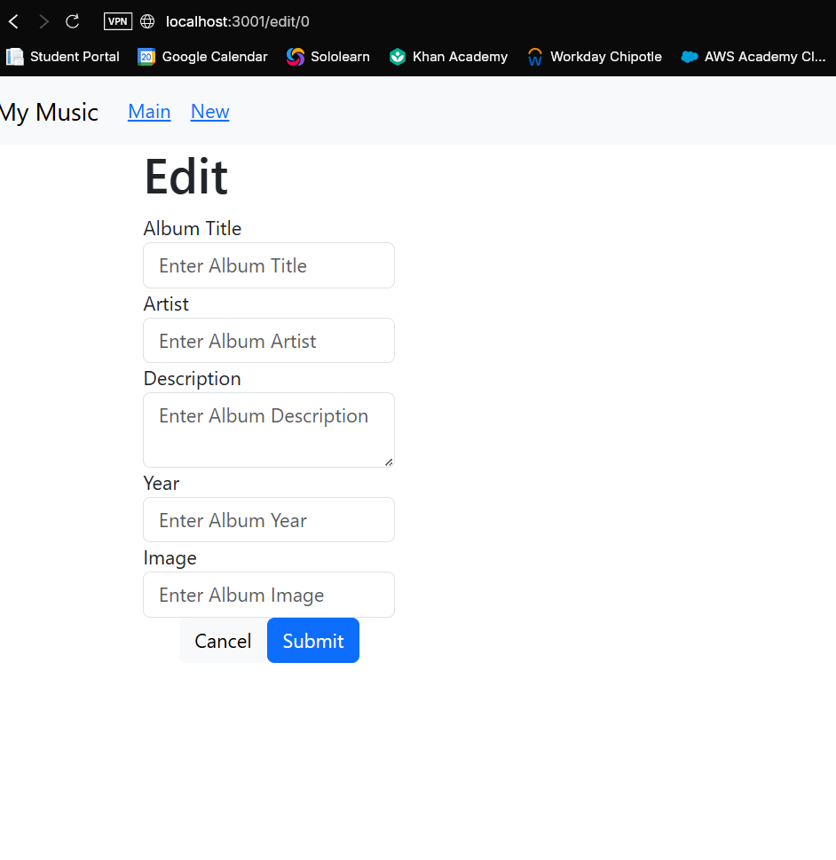
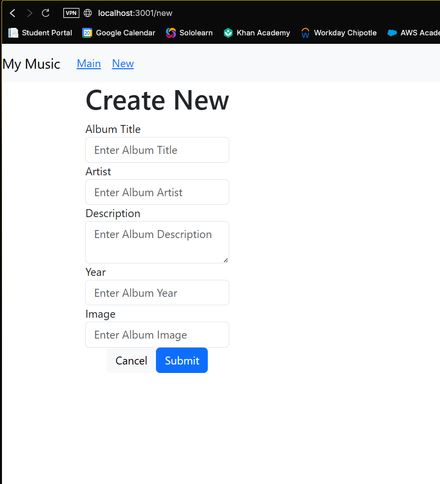

# Activity 7

## Executive Summary

The music application is a React based web application that allows users to search, view, add, and edit music albums. It uses route based navigation to handle different views and manage data through forms. Users can interact with albums through card interfaces and the app has dynamic routing for editing or viewing a certain album. In this lesson we added the ability to view the albums tracks both their lyrics and the youtube video.

## Part 1 Blog application

This is a screenshot of the application with 4 different posts.

This is a screenshot of the application deleting an existing post.

This is a screenshot of a newly added post to the web application.

## Part 2 Music application

This is a screenshot of the OneAlbum Screen with both the lyrics and youtube video present.

This is showing that clicking a different track will change the page.

In this section, we enhanced the form for adding a new album by turning it into a controlled component. This is a common React pattern for managing form inputs. These controlled components use React state to manage the current value of the input fields. This requires setting the value attribute of each input element to a state variable. We also followed JSX rules such as using className instead of class since class is a JavaScript keyword. Additionally, we added bootstrap for templates to match our needs.

This is a screenshot of the edit album page.

This is a screenshot of the new album page.

In this part of the lesson, we enhanced the existing NewAlbum component to support both creating new albums and edited existing ones. The component now checks if props.album is present to determine whether it is i edit or new mode. Also renamed props, components, and files to reflect the new name, EditAlbum. Updated functions like updateSingleAlbum to direct the user to either view or edit an album based on the URI. Some new terminology that was learned was intermediate callback methods which are unnecessary layers of function calls passed through components, they should be refactored for cleaner code. 

## Conclusion

In this activity, I learned how to build more advanced features in React by using controlled components to manage form inputs and maintain consistent state. In this activity we refactored components by combining the functionality of creating and editing in the same component. I also learned how to create dynamic routing in the application.  